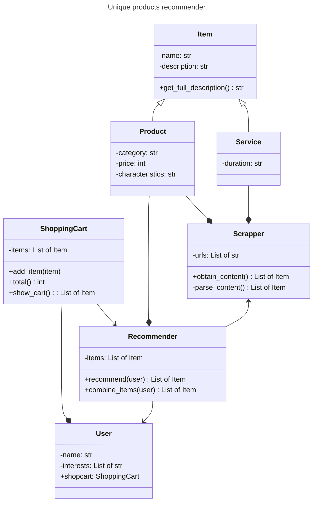

# SuperRecom
## Descripción del Problema
El proyecto busca solucionar la necesidad de recomendar productos únicos y personalizados a los usuarios, utilizando datos obtenidos en tiempo real desde sitios web de comercio electrónico. En un mercado digital abarrotado de opciones, ofrecer recomendaciones relevantes y atractivas puede mejorar la experiencia de compra y aumentar las conversiones. Este sistema debe ser capaz de extraer datos de productos desde diferentes sitios web, analizar esos productos y sugerir combinaciones que se ajusten a los intereses específicos de los usuarios.
## Enfoque de la Solución
La solución se lleva a cabo mediante la creación de un sistema modular compuesto por varias clases que interactúan entre sí para ofrecer recomendaciones precisas. El proceso comienza con la clase `Scraper`, que es responsable de realizar el scraping de datos desde URLs de comercio electrónico. Esta clase extrae la información relevante de cada producto, como el nombre, la descripción, la categoría, el precio y las características, transformando los datos crudos en objetos estructurados que pueden ser utilizados por otras partes del sistema.

Una vez obtenidos los datos, la clase `Recomendador` toma esos productos y los analiza en función de los intereses del usuario. Esta clase compara las características de los productos con los intereses específicos del usuario y genera una lista de productos recomendados. Además, es capaz de sugerir combinaciones de productos que podrían interesar al usuario en conjunto, como kits personalizados que incluyen varios artículos complementarios.
## Descripción de las Clases
- Scraper: Es la clase encargada de realizar el scraping web. Recibe una lista de URLs de las cuales extrae datos de productos mediante el análisis del HTML de las páginas web. Esta clase se enfoca en obtener la información relevante y estructurarla en objetos `Producto` que puedan ser utilizados por el recomendador.
- Producto: Es una clase que representa un producto individual con atributos como nombre, descripción, categoría, precio y características. Estos atributos son fundamentales para poder comparar y recomendar productos de manera efectiva.
- Recomendador: Esta clase procesa la lista de productos obtenida por el `Scraper` y genera recomendaciones basadas en los intereses del usuario. Además de recomendar productos individuales, también puede sugerir combinaciones de productos que puedan complementar los intereses del usuario, ofreciendo una experiencia de compra más personalizada.
- Usuario: Representa el perfil del usuario, incluyendo su nombre y sus intereses. Esta clase también incluye un carrito de compras, donde se pueden agregar los productos recomendados y mostrar el total de la compra, simulando la experiencia de un usuario en un entorno de comercio electrónico.

## DIAGRAMA DE CLASES

