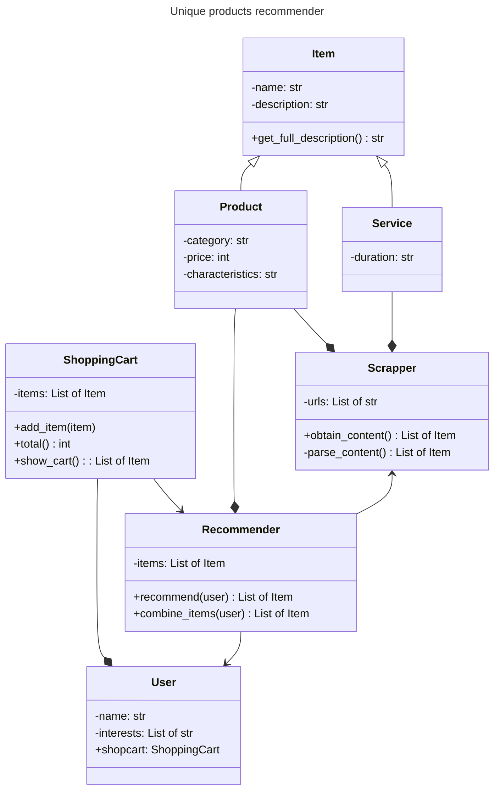

# SuperRecom
A project about recommending real products to people according to their interests.

```mermaid
---
title: Unique products recommender
---
classDiagram
    class Item {
        -name: str
        -description: str
        +get_full_description() str
    }
    class Product {
        -category: str
        -price: int
        -characteristics: str
    }
    class Service {
        -duration: str
    }
    Item <|-- Product
    Item <|-- Service
    class User {
        -name: str
        -interests: List of str
        +shopcart: ShoppingCart
    }
    class ShoppingCart {
        -items: List of Item
        +add_item(item)
        +total() int
        +show_cart(): List of Item
    }
    ShoppingCart --* User
    class Recommender {
        -items: List of Item
        +recommend(user) List of Item
        +combine_items(user) List of Item
    }
    Recommender --> User
    class Scrapper{
        -urls: List of str
        +obtain_content() List of Item
        -parse_content() List of Item
    }
    Product --* Recommender
    Product --* Scrapper
    Service --* Scrapper
    Scrapper <-- Recommender
    ShoppingCart --> Recommender
```
